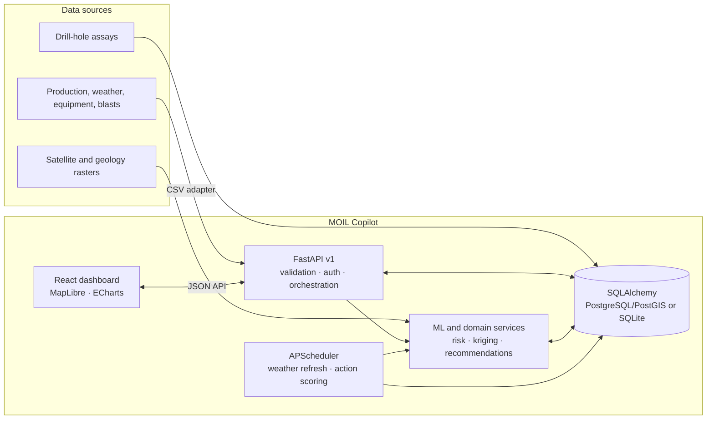

# MOIL Manganese Copilot

**SIH 2026 · PS 26009** | Decision support for manganese prospectivity, reserve estimation, and production shortfall response.

The app combines satellite/geology indicators, drill-hole assays, and mine operations data. It ranks areas to investigate, estimates reserve ranges from assays, forecasts production risk, and simulates operational recommendations. Satellite indicators do **not** directly detect underground ore.

## Architecture



**Request path:** the React client calls the versioned FastAPI routes. Routers enforce request contracts and authentication, then delegate calculations to services. SQLAlchemy persists mine and provenance records; trained models are loaded from `backend/artifacts`. The prospectivity raster workflow is optional and served through TiTiler when a Cloud Optimized GeoTIFF is available.

## Run Locally

### Docker Compose

Requires Docker Desktop/Engine and GNU Make. From the repository root:

```bash
test -f .env || cp .env.example .env  # PowerShell: if (!(Test-Path .env)) { Copy-Item .env.example .env }
make up                       # start PostGIS
make seed                     # optional synthetic demo history and drillholes
make train                    # train shortfall model
make run                      # API :8000, TiTiler :8001, web :5173
make reserves                 # optional; requires sufficient assay intervals
```

Compose expects `DATABASE_URL=postgresql+psycopg://moil:moil@db:5432/moil` and `MODEL_DIR=/app/artifacts` in `.env` (the defaults in `.env.example`). A native SQLite `.env` is not valid inside the API container.

Open <http://localhost:5173>; API docs are at <http://localhost:8000/docs>. `make down` stops services. Docker is not required for the native setup below.

### Native Windows (PowerShell)

Requires Python 3.10+, Node.js, and npm. From the repository root, prepare the Python environment:

```powershell
Copy-Item .env.example .env
py -3.10 -m venv .venv
.\.venv\Scripts\python.exe -m pip install -r backend\requirements.txt
$env:PYTHONPATH = "backend"
```

Seed and train only when you want the synthetic demo dataset (skip if using existing or uploaded data):

```powershell
.\.venv\Scripts\python.exe -m scripts.seed_synthetic --storm
.\.venv\Scripts\python.exe -m scripts.train_all
```

Start the API from the repository root:

```powershell
.\.venv\Scripts\python.exe -m uvicorn app.main:app --host 127.0.0.1 --port 8000
```

In a second terminal:

```powershell
cd web
npm ci
npm run dev -- --host 127.0.0.1 --port 5174
```

Open <http://localhost:5174>. The SQLite database path and model directory are set in the root `.env`; configuration is loaded when the API starts, so restart it after changing settings.

## Data Modes and Authentication

`DATA_MODE=demo|live` controls scheduled/live-feed behavior; it does not certify every stored record as live and does not change API authentication.

- **Demo:** `scripts/seed_synthetic.py` generates example operational and drill-hole data. The UI discloses synthetic sources.
- **Live:** weather can be refreshed from keyless Open-Meteo. Production, equipment, blasts, and assays remain whatever is in the database until real CSV data is uploaded; provenance is shown per source.
- **API key:** protected operations require `X-API-Key`. The local default is `change-me`; the backend `API_KEY` and frontend `VITE_API_KEY` must match. Live mode does not remove this requirement. Do not use the development default in a deployed environment; a frontend key is visible to browser users.

Use the **Data adapter** page to download templates and upload CSVs. Supported columns:

| Data | Required columns |
|---|---|
| Production | `mine_code,date,planned_t,actual_t` |
| Weather | `mine_code,date,rain_mm` |
| Blasts | `mine_code,date,delayed` |
| Equipment | `mine_code,unit_code,date,available_hours,scheduled_hours,breakdown` |
| Drillholes and assays | `mine_code,hole_code,lat,lon,collar_z,from_m,to_m,mn_pct` (optional `fe_pct`) |

## Models and API

| Capability | Approach | Result |
|---|---|---|
| Prospectivity | LightGBM, spatial-block validation, SHAP | Prospectivity scores for rasterized feature data |
| Reserve estimation | 3D ordinary kriging and 100 conditional block simulations | Approximate P10/P50/P90 tonnes and grade distribution |
| Shortfall risk | Quantile LightGBM over daily production efficiency and forecast signals | Risk level, fan chart, and contributing drivers |
| Recommendations | Operational rules and PuLP redeployment optimization | Ranked actions and what-if forecast |

API base: `/api/v1`. Interactive OpenAPI docs: `/docs`.

| Method | Endpoint | Use |
|---|---|---|
| GET | `/health` | Runtime mode, model availability, and data provenance |
| GET | `/mines`, `/risk/{code}` | Mine summaries and shortfall forecast |
| GET / POST | `/reserves/{code}` / `/reserves/{code}/recompute` | Read or compute reserve estimate; recompute is protected |
| GET | `/actions`, `/actions/{id}/simulate` | Recommendations and action scenario |
| POST | `/actions/refresh` | Regenerate recommendations; protected |
| POST | `/ingest/{kind}` | Validate and ingest CSV; protected |
| GET | `/ingest/template/{kind}`, `/ingest/records/{kind}` | CSV templates and latest records; protected |

The prospectivity raster endpoint is available when a trained raster model and COG are configured. Without those assets, the map still displays mine and regional deposit layers.

## Development

```bash
make test
```

The backend tests cover API endpoints, feature construction, optimization, and recommendations. Retrain the shortfall model with `make train`; feature generation is shared between training and serving to reduce train/serve skew.

## Important Assumptions

- Prospectivity ranks areas for investigation; drill data is required to estimate grade and tonnes.
- Known-deposit labels are positive-unlabeled; spatial-block validation helps limit geographic leakage.
- Reserve P10/P50/P90 values are approximate and depend on assay coverage and modeling assumptions.
- Recommendation recovery rates are assumptions to calibrate with MOIL operational history, not guaranteed production gains.

For the full MVP plan and rationale, see [`moil_manganese_mvp_plan.md`](moil_manganese_mvp_plan.md).
